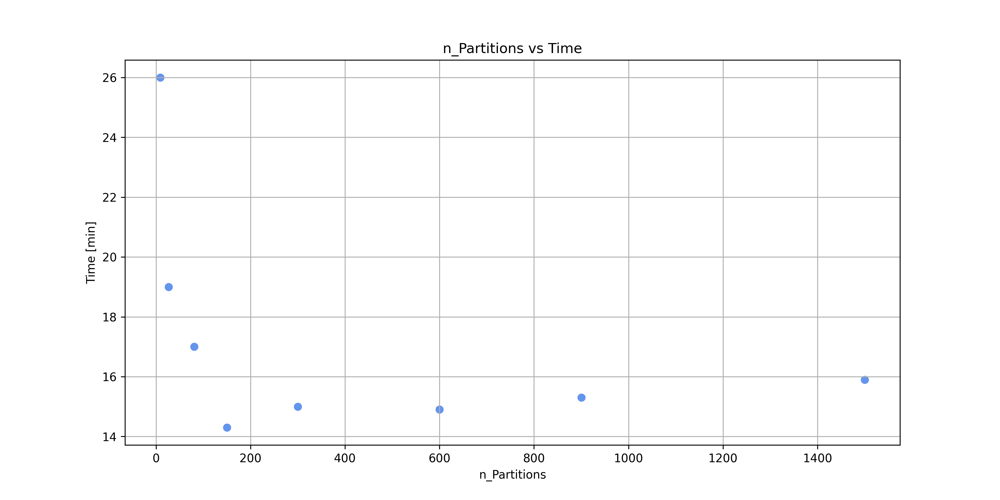

<h1 align="center">MAPD - mod. B - PoD<br> University of Padua <br> 2022/2023 <br> Batch analysis of cosmic rays using Drift Tubes detectors</h1>

<p align="center">
  
   
  
</p>

<h3 align="center"><b>Group 06:</b> A. Saccomani, E. Sarte, R. Tancredi, G. Zago<br></h3>

## Introduction

The goal of this project is to analyze real data collected in a particle physics detector to reconstruct the trajectory of muons from cosmic rays. Data are collected using Drift Tubes detectors based on ionization: charged particles ionize the gas mixture inside the detectors, producing electron-ion pairs. The electron velocity drift is fixed at $v_{drift} = 53.8 \:\mu m/ns$ thanks to specifically shaped electric fields. Signals are collected on the anodic wire, then amplified, digitalized, discriminated, and
sent through a DAQ system where a set of FPGAs perform the Time-to-Digital Conversion (TDC): to each electron cloud reaching the wire a digital signal is associated corresponding to the time of collection.
Each digitized signal is commonly referred to as an **hit**. 


## Objective

The goal of the project is to **preprocess** the dataset in order then to use the proper data for the analysis. After that it's possible to estimate the muon trajectories inside the telescope reconstructing two types of trajectories: **Local** and **Global**. After that a final result is obtained by plotting the angle of the global track and the local track
measured from **Chamber 2**, as this provides an estimate of the detector
angular resolution.


# Cluster setup
To perform the preprocessing and the whole analysis, we have set-up a cluster with 3 virtual machines (VMs) located in **CloudVeneto**. 

The cluster has been deployed by running the **Dask scheduler process** and the **Dask worker process** on the first VM, while on the other two VMs, only the **Dask worker process** has been run. This processes have been launched by *command line*, after having installed the latest Dask distribution available on each VM, with root permission. 

```bash
$ dask scheduler
Scheduler at:   tcp://192.0.0.100:8786

# for each worker:
$ dask worker tcp://192.0.0.100:8786
Start worker at:  tcp://192.0.0.1:12345
Registered to:    tcp://192.0.0.100:8786

```

In this way, we have one VM acting both as a scheduler and a worker, while the other two acting as workers only. We have 12 total threads, 4 for each worker. 

In order to send tasks to the scheduler and work in the Dask environment, we have launched a *Jupyter notebook server* on the first VM and then connected to its kernel through a ssh link. 


```python
from dask.distributed import Client
client = Client("localhost:8786")
```

## Data structure

The raw dataset is provided on a cloud storage s3 bucket hosted on CloudVeneto. The name of the Bucket is $\texttt{mapd-minidt-batch}$.

<!-- Link to visualize the list all contained files: https://cloud-areapd.pd.infn.it:
5210/swift/v1/AUTH_d2e941ce4b324467b6b3d467a923a9bc/mapd-minidt-batch/

Instructions: http://userguide.cloudveneto.it/en/latest/ManagingStorage.html#
object-storage-experimental -->

In order to access the bucket and the retrieve all the files stored inside it, the credentials needed to access the files were provided by the CloudVeneto:

```bash
cat credentials.json
{
    "access_key":"aaaabbbbccccddddeeeeffff", 
    "secret_key":"gggghhhhiiiijjjjkkkkllll"
}
```

The dataset is composed of multiple binary files encoding the stream of hits collected:
* Every hit is encoded as a 64bit word
* Each word has the exact same structure

The 64b data-format complies to the following standard:
* 0-4 (5 bit) -> **TDC**
* 5-16 (12 bit) -> **BX**
* 17-48 (32 bit) -> **ORBIT**
* 49-57 (9 bit) -> **CHAN**
* 58-60 (3 bit) -> **FPGA**
* 61-63 (3 bit) -> **HEAD**

Each event is identified by a **unique ORBIT value**.

## Data unpacking

After having read the unstructured data, we unpacked these raw objects into a structured dataframe containing the 6 columns of interest (**TDC**, **BX**, **ORBIT**, **CHAN**, **FPGA**, **HEAD**). 

To do this in **Dask** we used the function `read_bytes` from `dask.bytes` in order to read and decode binary files. We read the files into a fixed number of blocks (partitions) that we initially set to 81, equal to the number of files (each file is about 10 Mb). After that with the function **process**, we transformed the binary data into decimal numbers in the way described before using the numpy function `frombuffer`. 

Finally, we created a dataframe of the blocks using the `from_delayed` method from `dask.dataframe`. 

### Load data

```python
# Configure S3 endpoint URL and credentials
bucket_name = 'mapd-minidt-batch'
credentials = {"key":cred['access_key'], 
                "secret":cred['secret_key'], 
                "endpoint_url":'https://cloud-areapd.pd.infn.it:5210'}

urlpaths=[f's3://{bucket_name}/data_{i:06}.dat' for i in range(0, 81)]

sample, blocks = dbytes.read_bytes([url for url in urlpaths], **credentials)

@dask.delayed
def process(bytes):
    ...
data = dframe.from_delayed([process(p[0]) for p in blocks])
```

## Dataset cleansing
After loading the dataset, we needed to sanitize it in order to continue with the analysis of the trajectories. We needed to select the data that pertain to the TDC hits. The **HEAD** is an header informing which word is associated to the TDC hits (marked with **HEAD** == 2). The other value of **HEAD** (0,1,3,4,5) have been discarded. Then, we mapped each row to the correspondent chamber following these mapping:
* **Chamber0** -> (**FPGA** = 0) and (**CHANNEL** in [0-63])
* **Chamber1** -> (**FPGA** = 0) and (**CHANNEL** in [64-127])
* **Chamber2** -> (**FPGA** = 1) and (**CHANNEL** in [0-63])
* **Chamber3** -> (**FPGA** = 1) and (**CHANNEL** in [64-127])

Chambers contain 64 cells arranged in 4 layers of 16 cells each. A single cell is made up of $42\cdot13$ $mm^2$ (width X height) and it follows a specific recurrent pattern enumeration, given the **CHANNEL** value.
Three chambers (0,2,3) are in the same orientation and the fourth (1) is rotated 90 degrees, in order to measure in the orthogonal view. To measure the 2D trajectory we will use only chamber (0,2,3) so we discard all entries with (**Chamber** == 1).
With the functions **manipulate_data** and **get_layers** we added the column of the dataset defining the position of the hit in the layout of the detector. We then assigned to each hit the corresponding chamber, layer and cell.
Another computation performed was to group the rows by **ORBIT** and maintain only the groups that have one row with (**FPGA** == 1 and **CHANNEL** == 128). This represents the passage time of the muon $t_0$, provided by the external scintillator signal. 
We also kept only the first hit in the same cell, and eliminated some ancillary data in the dataset (like **CHANNEL** == 138).

### Improving dataset readibility
Now that we have the filtered rows, our goal is to apply some additional oparation so to obtain useful quantities to then analyze the trajectories. First we assigned the vertical position of the chamber and corrected the time offset of $t_0$, that is near $95 ns$ but has little differences between different chambers. This is because the time information from the scintillator is roughly $95 ns$ ahead with respect to the actual time of passage of a muon.

### Time information:
We need to manage the three time counters provided by each signal to obtain the actual time of the passage in $ns$. The three counters are the following:
* 1 **ORBIT** = 3564 **BX**
* 1 **BX** = 25 ns
* 1 **TDC** = 1/30 **BX**

An absolute time can be associated to each hit by converting the counters as follows:
$t_{hit}(ns) = 25 \cdot (\textbf{ORBIT} \cdot 3564 + \textbf{BX} + \textbf{TDC}/30)$

### Space information:
Now given the time information, we computed the position inside the cell where the hit has happened. Thanks to the constant $v_{drift}$ we can write:
\begin{equation*}
    x_{hit}=(t_{hit}-t_0)\cdot v_{drift}
\end{equation*}

This value leaves a left-right ambiguity. We know the distance between the trajectory of the muon and the anode (center of the cell) but we do not know if the muon has passed in the right-half or in the left-half of the cell. To solve this ambiguity, we need more analysis on the possible trajectories of the muon. We also calculated the vertical distance using the parameter given for each chamber and the height of the layers.

### Further cleansing of the dataset
To get useful data to continue with the analysis we need to apply other constraints to each event: to each unique value of **ORBIT**, first we discarded every event in which there were unphysical values of the position (for example points that have distance from the anod bigger than half of the length of the cell, or time $t_{hit}$ below $t_0$). Then, we limited the dataframe to the events that have at least two hits per chambers and a maximum of 12 hits per chamber, with a maximum of 3 hits per layer. 

Now data is ready for the next computation. We define the `manipulate_dataframe` function and in order to apply this function to all the dask dataframes we use the command **map_partitions**, so that the function is applied to each partition. Each of these contains a **pandas dataframe** given in input in the **manipulate_dataframe**, which returns a filtered pandas dataframe. Therefore, we obtain a filtered dask dataframe.

```python
def manipulate_dataframe(df):  
    ...
filtered_data = data.map_partitions(manipulate_dataframe, enforce_metadata=False)
```

## Find local tracks

Before starting to calculate the trajectories for each chamber and for each event, we need to make sure to remove most of the noise (if not all), so all the wrong hits.
Let's start showing some examples of 'good events':

<p align="center">
    
    
    
</p>
In these cases all the cells that gave a signal are only the ones that make up the trajectory.

But, there are some cases where other cells also generated a signal:

<p align = 'center'>
    
    
</p>

We would like to filter out these easy-to-spot cases: to solve this, we developed an algorithm to group the cells by proximity and then discard the groups with too few or too many hits. Here we show the results for the cases seen before:

<p align = 'center'>
    
    
</p>

The next step is to calculate the right trajectory by solving the left-right ambiguity. We do that by selecting every possible left right combination for cell, so if we have 4 cells, we have 16 possible combinations of left and right. For every combination we calculate the linear regression of the points and then we sum the squared distance from the points to the line. We choose the line with the lowest sum, and we also keep the second-best line.

<p align = 'center'>
    
    
</p>

```python
def calculate_local_track(df):  
    ...
# Now that we have added the new columns, we can perform the next lazy computation:
test_and_track = filtered_data.map_partitions(calculate_local_track, enforce_metadata=False)

# Split the DataFrame based on columns
# Select specific columns for both datasets
analized_data = test_and_track.loc[:, ['TDC', 'BX', 'CHANNEL', 'FPGA', 'HEAD', 'TIME', 'ORBIT', 'T0',
       'CHAMBER', 'CELL', 'LAYER', 'CELL_X', 'CELL_Y', 'REL_TIME', 'DISTANCE', 'HIT_X', 'HIT_X2']]  
tracks = test_and_track.loc[:, ["ORBITt", "CHAMBERt", "SLOPEt", "INTERCEPTt", "SLOPE2t", "INTERCEPT2t"]]

```

## Find global tracks
Last but not least, we calculate the global tracks. To do that, we use the set of points of the best and second-best lines for each chamber. We try every possible combination of the best and second best set of points to choose the best **global line** in the same way as before. We do this because, for example, the set of points of the best line for a chamber could not be the best set of points for the global line, but the second-best set could fit better. In this case there are a maximum of 3 chambers, leading to a maximum of 8 possible combinations for the best and second-best fitting line.

<p align = 'center'>
    
    
    
</p>

The following functions implement the global tracks fitting.

```python
# Here we try to combine the local track to form a global track
def calculate_global_track(df, tracks):
    ...

meta = pd.DataFrame([], dtype=np.double, columns=['G_SLOPE', 'G_INTERCEPT', 'CHAMBER0', 'CHAMBER2', 'CHAMBER3'])
results = dframe.map_partitions(calculate_global_track, analized_data, tracks, meta=meta)
```

The finally ask the **Dask** scheduler to show all the instructions we have set. The result is a Direct Acyclic Graph (**DAG**):
<p align = 'center'>
    
</p>

## Benchmarking: Comparison between different **partitions** and **threads**
* Number of partitions 

<center>

| # Partitions | Time (min) |
|:------------:|:----------:|
|      9       |     26     |
|     27       |     19     |
|     81       |     17     |
|     150      |    14.3    |
|     300      |     15     |
|     600      |    14.9    |
|     900      |    15.3    |
|    1500      |    15.9    |

</center>

<p align = 'center'>
    
</p>

* Number of threads -- 150 partitions 
<center>

| # Threads per worker | Time (min) |
|:--------------------:|:----------:|
|          4           |    14.3    |
|          8           |    14.8    |
|         12           |    15.0    |

</center>

### Stop client
```python
client.close()
```